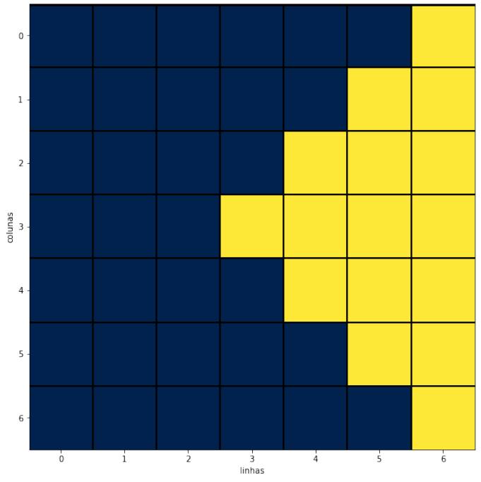
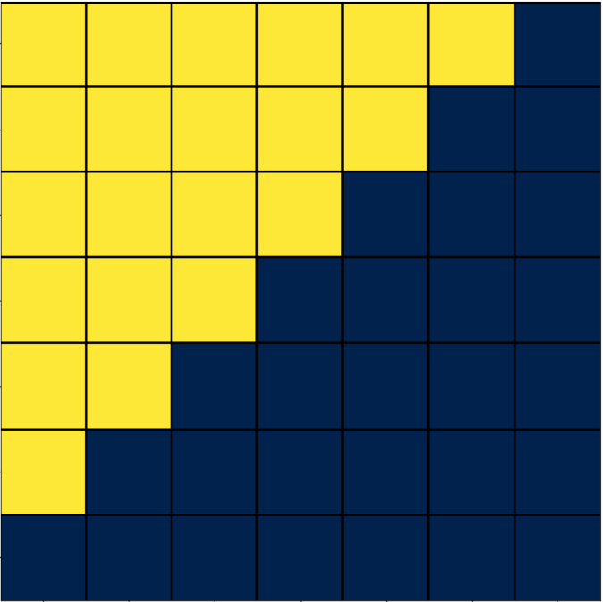

# Somatórios duplos:

$\sum_{j = 1}^{n/2 - 1}\sum_{k=1}^{j}a_{j,n-k} + \sum_{j = n/2}^{n - 2}\sum_{k=j}^{n-2}a_{j,k+1}$


```python
import matplotlib.pyplot as plt
import numpy as np

b = ([0,0,0,0,0,0,0],
     [0,0,0,0,0,0,0],
     [0,0,0,0,0,0,0],
     [0,0,0,0,0,0,0],
     [0,0,0,0,0,0,0],
     [0,0,0,0,0,0,0],
     [0,0,0,0,0,0,0],
                    )

fig,ax = plt.subplots()
soma = 0

#somatório duplo
for j in range(0,len(b)-3):
 for k in range(1,j+2):
        b[j][len(b) - k] = 1
        soma += b[j][k]

for j in range(len(b)-3,len(b)):
 for k in range(j,len(b)):
        b[j][k] = 1
        soma += b[j][k]
 
a = np.asarray(b) #convertendo para um array

#montagem do gráfico

ax.imshow(a,cmap = "cividis")

plt.xlabel("linhas")

plt.ylabel("colunas")
print(a)
ax.xaxis.grid(False)
ax.yaxis.grid(False)
grids_x = [0.50,1.50,2.50,3.50,4.50,5.51]
grids_y = [0.50]

ax.axhline(-0.48,color = "black",linewidth = 3)

for k in grids_x:
     ax.axhline(k,color = "black",linewidth = 2)

for k in grids_x:
 ax.axvline(k,color = "black",linewidth = 2)
plt.subplots_adjust(top = 2,right = 3.5)
plt.show()

```

    [[0 0 0 0 0 0 1]
     [0 0 0 0 0 1 1]
     [0 0 0 0 1 1 1]
     [0 0 0 1 1 1 1]
     [0 0 0 0 1 1 1]
     [0 0 0 0 0 1 1]
     [0 0 0 0 0 0 1]]


    

    


$\sum_{j = 0}^{n-2}\sum_{k=j}^{n-2}a_{n-2 - j,n - 1 - k}$


```python
import matplotlib.pyplot as plt
import numpy as np

b = ([0,0,0,0,0,0,0],
     [0,0,0,0,0,0,0],
     [0,0,0,0,0,0,0],
     [0,0,0,0,0,0,0],
     [0,0,0,0,0,0,0],
     [0,0,0,0,0,0,0],
     [0,0,0,0,0,0,0],
                    )

fig,ax = plt.subplots()
soma = 0

#somatório duplo
for j in range(0,len(b)): #loop for das linhas
 for k in range(0,j): # loop for das colunas
        b[len(b)-j - 1][k] = 1
        soma += b[j][k]

a = np.asarray(b) #convertendo para um array

#montagem do gráfico

ax.imshow(a,cmap = "cividis")

plt.xlabel("linhas")

plt.ylabel("colunas")
print(a)
ax.xaxis.grid(False)
ax.yaxis.grid(False)
grids_x = [0.50,1.50,2.50,3.50,4.50,5.51]
grids_y = [0.50]

ax.axhline(-0.48,color = "black",linewidth = 3)

for k in grids_x:
     ax.axhline(k,color = "black",linewidth = 2)

for k in grids_x:
 ax.axvline(k,color = "black",linewidth = 2)
plt.subplots_adjust(top = 2,right = 3.5)
plt.show()

```

    [[1 1 1 1 1 1 0]
     [1 1 1 1 1 0 0]
     [1 1 1 1 0 0 0]
     [1 1 1 0 0 0 0]
     [1 1 0 0 0 0 0]
     [1 0 0 0 0 0 0]
     [0 0 0 0 0 0 0]]


    

