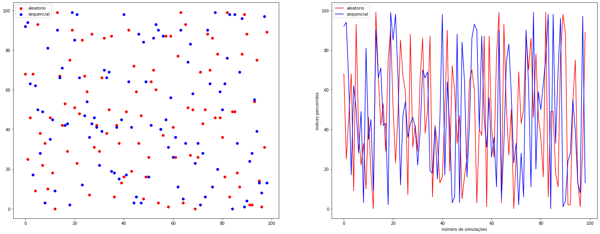

# Comparação aleatória:


```python
import random

num_exp = 0 #Quantidade de experimentos realizados
res_comp_aleatorio = [] #lista com os resultados das comparações de cada experimento

while num_exp < 99:
    A = [] #primeira sequencia

    B = [] #segunda sequencia

    posicoes = []

    for x in range(0,100):#preencher a sequencia A com 0
        A.append(0)
    
    for x in range(0,100):#preencher a sequencia B com 0
        B.append(0)

    for x in range(0,100):
        posicoes.append(x) #lista de indices aleatorios

    A[random.randint(0,99)] = 1 # altera a sequencia A e coloca um elemnto diferente 
    random.shuffle(posicoes) #organiza a lista de maneira aleatoria
    
    j = 0 #contador
    for k in posicoes: #Verificando se as sequências A e B não são iguais
    
        if ((A[k]) == (B[k])):
            j += 1
        elif (int(A[k]) != int(B[k])):
            res_comp_aleatorio.append(j)
            j = 0 #Zera o contador para realizar outra comparação
            
            
    num_exp += 1
   
   
print( res_comp_aleatorio)

exp = []

for x in range(0,99):
    exp.append(x)
```

    [68, 25, 46, 68, 9, 93, 38, 22, 33, 10, 46, 18, 0, 99, 67, 42, 53, 29, 75, 90, 51, 23, 48, 85, 67, 59, 7, 88, 31, 42, 29, 66, 86, 38, 50, 87, 6, 42, 33, 13, 16, 49, 90, 19, 72, 59, 33, 47, 5, 16, 26, 64, 70, 60, 3, 40, 37, 87, 1, 87, 41, 26, 77, 99, 3, 93, 51, 27, 50, 0, 26, 69, 43, 50, 88, 70, 86, 46, 78, 46, 36, 16, 99, 6, 49, 49, 18, 11, 78, 98, 88, 2, 2, 54, 75, 14, 1, 31, 89]


# Comparação sequêncial:


```python
num_exp = 0
res_comp_sequencial = []
j = 0 #contador

while num_exp < 99:
    A = []
    B = []
    j = 0
    for x in range(0,100):
        A.append(0)
    
    for x in range(0,100):
        B.append(0)
        
    A[random.randint(0,99)] = 1
    
    sequencia = []
    for x in range(0,100):
        sequencia.append(x)
    
    for k in sequencia: #Verificando se as sequências A e B não são iguais
    
        if ((A[k]) == (B[k])):
            j += 1
        elif (int(A[k]) != int(B[k])):
            res_comp_sequencial.append(j)
            j = 0
    num_exp += 1
   
   
print(res_comp_sequencial)

```

    [92, 94, 63, 17, 62, 50, 28, 49, 3, 81, 35, 45, 9, 90, 66, 71, 42, 43, 2, 99, 85, 98, 66, 12, 47, 54, 36, 43, 46, 41, 22, 39, 70, 66, 69, 19, 18, 41, 15, 45, 98, 17, 64, 41, 3, 6, 88, 3, 84, 64, 16, 42, 86, 93, 90, 40, 87, 45, 31, 56, 26, 36, 11, 90, 5, 33, 74, 83, 58, 23, 33, 2, 28, 6, 90, 63, 11, 99, 20, 59, 50, 63, 76, 98, 0, 98, 33, 69, 96, 1, 4, 24, 28, 55, 39, 13, 8, 97, 13]


```python
import matplotlib.pyplot as plt
fig, (ax,ax_1) = plt.subplots(1,2)
plt.xlabel("número de simulações")
plt.ylabel("indices percorridos")
ax.scatter(exp,res_comp_aleatorio,color = "red",label = "aleatorio")
ax.scatter(exp,res_comp_sequencial,color = "blue",label = "sequencial")
ax_1.plot(exp,res_comp_aleatorio,color = "red",label = "aleatorio")
ax_1.plot(exp,res_comp_sequencial,color = "blue",label = "sequencial")
plt.legend()
ax.legend()
plt.subplots_adjust(top = 2,right = 3.5)
```


    

    


```python
soma = 0
for n in range(0,99):
    soma += res_comp_sequencial[n]
    
print("Soma dos indices das comparações sequenciais:" ,soma)
```

    Soma dos indices das comparações sequenciais: 4742


```python
soma_1 = 0
for n in range(0,99):
    soma_1 += res_comp_aleatorio[n]
    
print("Soma dos indices das comparações Aleatórias:" ,soma_1)
```

    Soma dos indices das comparações Aleatórias: 4648
